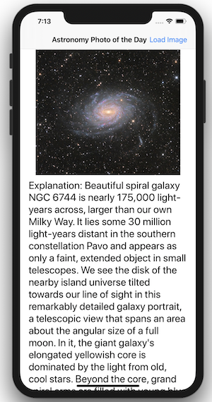

# Concurrency

Introduction to Concurrency and Grand Central Dispatach in Swift. In this app we fixed a non-concurrent app that blocked the main thread and dispatched the image processing work to a global queue with a QoS of .userInitiated when prevented the main thread to be blocked and enhanced the scrolling experience for the user while the image is being loaded.

#### App allows the user to scroll concurrently while image is being loaded.

## [Video Lecture](https://youtu.be/Qy40OXUMtmc)
